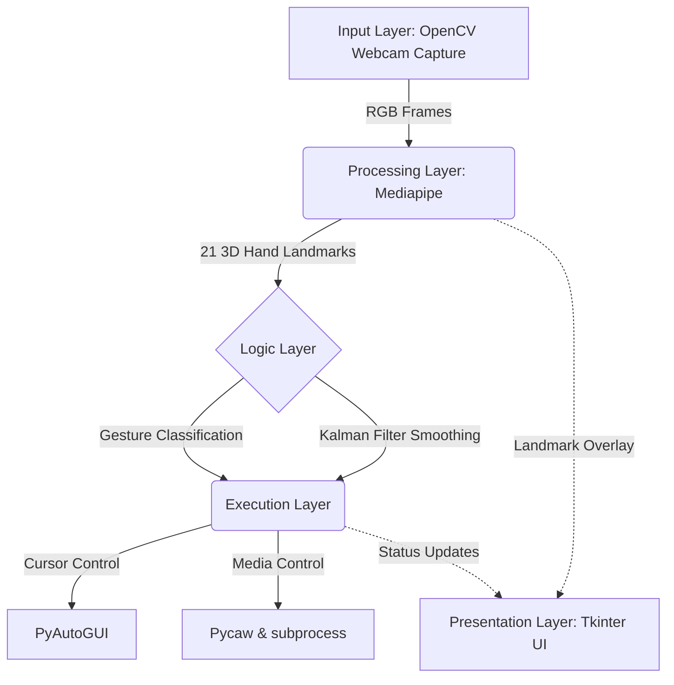
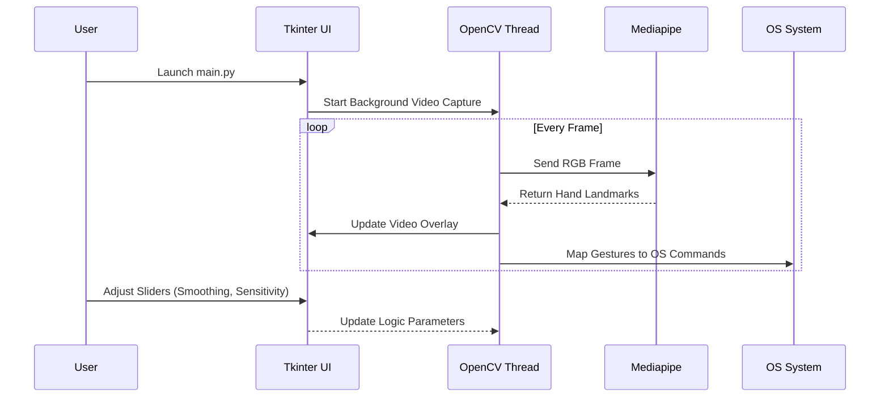

# Gesture Mouse Controller

A powerful, interactive computer vision application that transforms a standard webcam into a fully functioning, hands-free mouse. 

---

## Table of Contents
1. [Introduction](#-introduction)
2. [Features](#-features)
3. [Technology Stack](#-technology-stack)
4. [System Architecture](#-system-architecture)
5. [Mathematical Foundation](#-mathematical-foundation)
6. [Gesture-to-Action Mapping](#-gesture-to-action-mapping)
7. [Installation & Setup](#-installation--setup)
8. [Workflow](#-workflow)
9. [Results & Discussion](#-results--discussion)
10. [Challenges & Solutions](#-challenges--solutions)
11. [Future Scope](#-future-scope)

---

## Introduction
The **Gesture Mouse Controller** replaces the need for a physical mouse. By analyzing a live video feed, the application tracks hand landmarks and classifies gestures in real-time. These physical hand gestures are seamlessly mapped to system-level commands, allowing users to move the cursor, click, scroll, drag files, and manage system brightness or volume—entirely touch-free.

---

## Features
* **Real-time Hand Tracking**: Extremely low latency hand detection.
* **Kalman Filter Smoothing**: Eliminates cursor jitter and ensures buttery-smooth pointer movement.
* **Custom User Interface**: Built-in Tkinter dashboard to monitor camera feed, customize settings (smoothing, sensitivity), and map custom files to gestures.
* **Deep System Integration**: Native bindings for system volume and screen brightness adjustments.

---

## Technology Stack

| Component | Library/Tool | Purpose |
| :--- | :--- | :--- |
| **Language** | Python 3.12 | Core logic and backend programming. |
| **Computer Vision** | OpenCV (`cv2`) | Capturing and processing live video frames. |
| **Machine Learning** | Google Mediapipe | Detecting 21 distinct 3D landmarks on a human hand. |
| **OS Interaction** | PyAutoGUI | Translating calculated coordinates to actual OS mouse movements. |
| **User Interface** | Tkinter & PIL | Building the interactive frontend dashboard. |
| **Mathematics** | FilterPy (Kalman Filter)| Mathematical smoothing of spatial data to reduce jitter. |
| **System Control** | Pycaw & screen-brightness-control | Direct interaction with Windows audio and display APIs. |

---

## System Architecture



---

## Mathematical Foundation

### 1. Coordinate Projection
To translate the index finger's position from the camera lens to the computer screen, a linear transformation is applied. Given the camera resolution ($w_{cam} \times h_{cam}$) and screen resolution ($w_{screen} \times h_{screen}$):

$$ x_{screen} = \left( \frac{x_{cam}}{w_{cam}} \right) \times w_{screen} $$
$$ y_{screen} = \left( \frac{y_{cam}}{h_{cam}} \right) \times h_{screen} $$

### 2. Kalman Filter Smoothing
Raw webcam coordinates are noisy. A Kalman Filter predicts the actual state by minimizing the mean of the squared error. 

**Prediction Equations:**
$$ \hat{x}_{k|k-1} = F_k \hat{x}_{k-1|k-1} + B_k u_k $$
$$ P_{k|k-1} = F_k P_{k-1|k-1} F_k^T + Q_k $$

**Update Equations:**
$$ K_k = P_{k|k-1} H_k^T (H_k P_{k|k-1} H_k^T + R_k)^{-1} $$
$$ \hat{x}_{k|k} = \hat{x}_{k|k-1} + K_k(z_k - H_k \hat{x}_{k|k-1}) $$

Where $F$ is the state-transition model, $H$ is the observation model, $Q$ is process noise, and $R$ is observation noise. This successfully stops cursor jitter.

---

## Gesture-to-Action Mapping

The system supports a variety of pre-defined hand poses mapped to OS commands.

| Detected Gesture | Hand | Mapped Action |
| :--- | :---: | :--- |
| **Index Pointing** | Left / Right | Move Cursor |
| **Victory Sign** | Left | Scroll Up |
| **Victory Sign** | Right | Scroll Down |
| **Three Fingers** (Partial) | Left | Swipe Left |
| **Three Fingers** (Partial) | Right | Swipe Right |
| **Open Hand** | Left | Brightness Up |
| **Open Hand** | Right | Brightness Down |
| **Thumb Extension** | Right | Click / Drag Toggle |

*(Note: Custom files can also be bound to these actions via the UI)*

---

## Installation & Setup

1. **Clone the repository:**
   ```bash
   git clone https://github.com/atharvamankar17/CS4Everyone-Hackathon.git
   cd <project-folder>
   ```
2. **Set up a Virtual Environment:**
   ```bash
   python -m venv venv
   venv\Scripts\activate
   ```
3. **Install Dependencies:**
   ```bash
   pip install -r requirements.txt
   ```
   *(Note: Ensure you are using Python 3.12 and Mediapipe 0.10.14 for full compatibility).*

4. **Run the Application:**
   ```bash
   python main.py
   ```

---

## Workflow


---

## Results & Discussion
The application performs incredibly well under good lighting conditions.
* **Latency:** Cursor response is near-instantaneous (~30 FPS).
* **Accuracy:** The Kalman Filter entirely eliminates the "shaking" issue common in raw coordinate tracking.
* **Resource Usage:** By running inference on the CPU, it utilizes moderate resources but leaves enough overhead for other desktop applications to run smoothly alongside it.

---

## Challenges & Solutions

| Challenge | Impact | Implemented Solution |
| :--- | :--- | :--- |
| **Jittery Cursor** | Unusable mouse targeting due to raw coordinate noise. | Implemented a **Kalman Filter** algorithm to mathematically predict and smooth transitions. |
| **UI Freezing** | Tkinter dashboard became unresponsive when OpenCV camera looped. | Isolated the OpenCV video capture and processing into a distinct background **Thread**. |
| **Library Depreciation** | `AttributeError` from missing Mediapipe legacy modules on Python 3.12. | Downgraded and pinned `Mediapipe==0.10.14` in `requirements.txt`. |
| **Pycaw API Changes** | Volume control threw initialization errors. | Updated codebase to use the modern `.EndpointVolume` interface with a fallback for older versions. |

---

## Future Scope
* **Dynamic Lighting Adaptation**: Implementing CLAHE (Contrast Limited Adaptive Histogram Equalization) to improve landmark detection in dark environments.
* **Custom Gesture Training**: Allowing users to train their own unique hand gestures using a mini neural network within the app.
* **Multi-Monitor Support**: Upgrading the coordinate mapping math to handle extended display setups.
